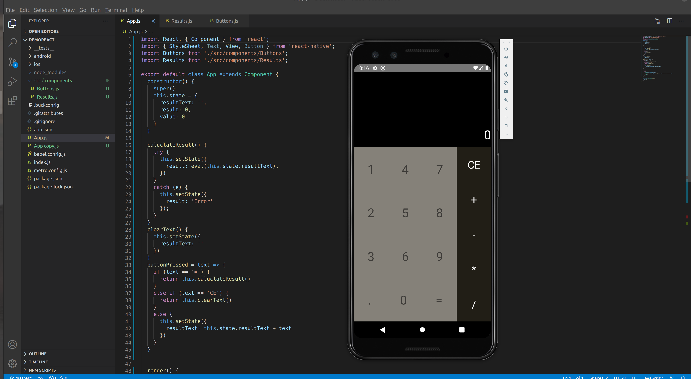

# React Native Calculator

> This is a basic react native calculator which performs addition,subtraction, multiplication and division.

## Components Used.
1. Button.js  : This component is responsible to render button layout for the calculator and passes value to its parent component i.e, App.js
1. Result.js  : This component is responsible to render result layout of the calculator and fetches value from its parent component i.e, App.js
1. App.js : This is the main file which performs all final rendering and calculaton part.

# Screenshot of the App

###### Created By: Pranav P Patil
